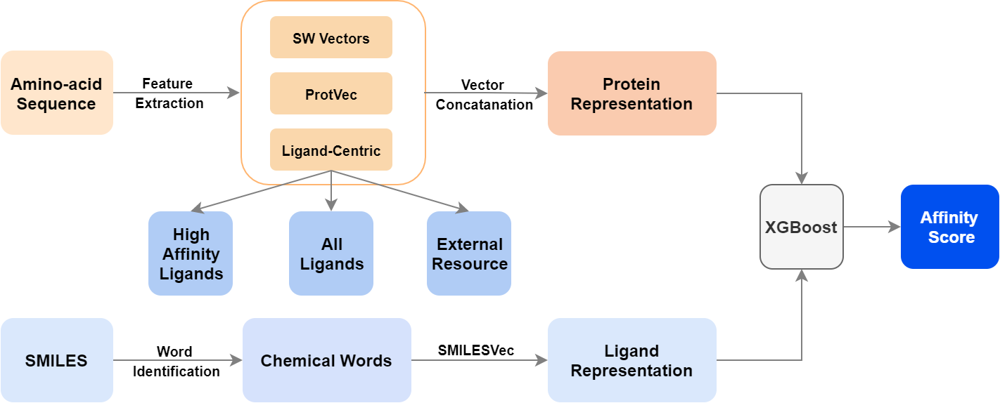

# ChemBoost

ChemBoost is a chemical-language based drug - target affinity prediction framework. The models in ChemBoost leverage distributed chemical word vectors to represent chemicals and a combination of sequence-driven and ligand-centric features to represent proteins. Thanks to chemical-language based representations, several ChemBoost models achieve state-of-the-art level prediction performance on BDB and KiBA data sets and a demonstrated robustness to cases where functional protein similarity cannot be inferred from the similarities in the protein sequence.

 

## How to Run

The experiments in ChemBoost is run with the following configuration:

```
python=3.7.3
numpy=1.16.4
pandas=0.24.2
xgboost=0.90
sklearn=0.21.2
gensim=3.8.0
sentencepiece==0.1.95
```

To run the experiments from scratch:

- Install the packages listed above. (Using `conda` is recommended, except sentencepiece which can be installed through `pip`.)
- Download the datasets [from this link](https://cmpe.boun.edu.tr/~riza.ozcelik/chemboost/data/chemboost_data.zip) and place them under the `data` folder.
- Then use the following command format under the root directory in order to replicate results for a model:

`python run_experiments.py {dataset_name} {model_name} {save_name}`

where `{dataset_name}` is replaced with either `kiba` or `bdb` and `{model_name}` expects the input to be in the models in the paper. See `Line 15 in src/utils.py` for a full list of acceptable model names. Last, you can set `{save_name}` any filename of your choice.

### Citation

If you use ChemBoost in your study, please cite:

```
@article{ozccelik2020chemboost,
  title={ChemBoost: A Chemical Language Based Approach for Protein--Ligand Binding Affinity Prediction},
  author={{\"O}z{\c{c}}elik, R{\i}za and {\"O}zt{\"u}rk, Hakime and {\"O}zg{\"u}r, Arzucan and Ozkirimli, Elif},
  journal={Molecular Informatics},
  year={2020},
  publisher={Wiley Online Library}
}
```

